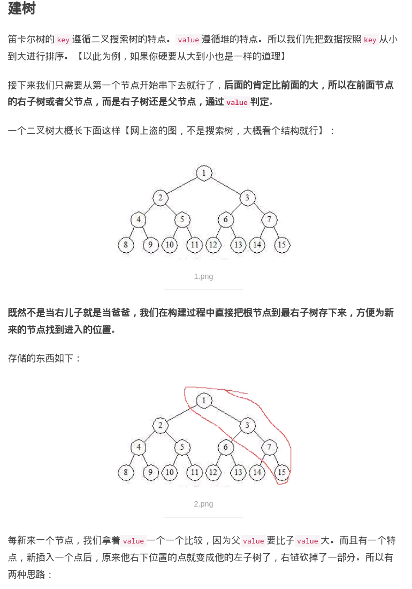

# cartesian tree

[ref](https://www.jianshu.com/p/1a89bbb6aab5)

key:分布遵循BST的规律，即左子树key<根key<右子树key
value:分布遵循堆的规律，即父value < 子value/子value < 父value
父value < 子value: 最小堆
子value < 父value：最大堆




```go

N := 1000

root := -1
vals := make([]int, N)
lefts, rights := make([]int, N), make([]int, N)


func init() {
    for i := 0 ; i <N; i++ {
        vals[i] = N - i
    }
}

//big heap
func create() {
    sk := make([]int)
    for i := 0; i < N; i++ {
        rights[i] = -1
        lefts[i] = -1

        v := vals[i]
        c := -1
        for len(sk) > 0 && vals[sk[len(sk)-1]] <= v {
            c = sk[len(sk)-1]
            sk = sk[:len(sk)-1]
        }

        if len(sk) > 0 {
            p := sk[len(sk)-1]
            rights[p] = i
        }else{
            root = i
        }

        lefts[i] = c
        sk = append(sk, i)
    }
}


func print(u: int) {
    if u < 0 {
        return
    }
    print(lefts[u])
    fmt.Print(vals[u])
    print(rights[u])
}


// use 1: range max
func rangeMax(bgn, end int) int {
    u := root
    
}


```